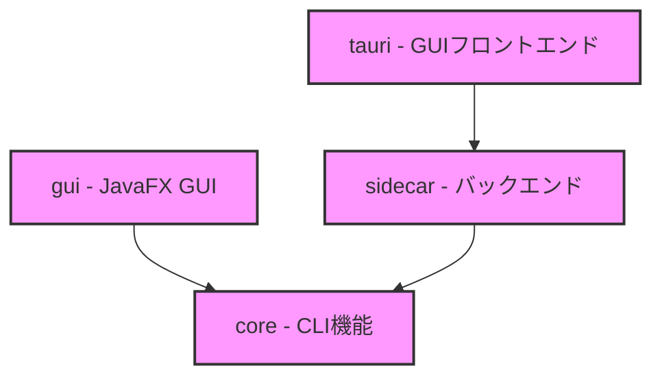

# DBUnit-CLI モノレポ 共通開発ルール

このドキュメントは、DBUnit-CLIモノレポ全体での作業に関するルールを定義します。各プロジェクトでの作業を開始する前に、このドキュメントを参照してモノレポ全体の構成を理解してください。

## 1. プロジェクト構成

DBUnit-CLIは以下の4つのプロジェクトで構成される統合アプリケーションです：



### 1.1. 各プロジェクトの概要

#### core
- コアとなるCLI機能を提供
- GraalVMのnative-imageとしてビルド
- 共通ライブラリとしてjarを提供
- データベース操作の基本機能を実装

#### gui
- JavaFXベースのGUIアプリケーション
- coreの機能をデスクトップアプリとして提供
- ユーザーフレンドリーなインターフェース

#### sidecar
- Micronautベースのバックエンドサービス
- TauriアプリケーションのREST API提供
- coreの機能をHTTPインターフェースで公開

#### tauri
- 次世代GUIフロントエンド（Tauri v2）
- sidecarのAPIを利用したモダンなUI
- クロスプラットフォーム対応

## 2. 開発ルール

### 2.1. プロジェクト固有のルール

各プロジェクトには独自の開発ルールが定義されています：

```
[プロジェクト]/
└── .roo/
    └── rules/
        ├── 01-rules.md      # 共通ルール
        ├── rules-code/      # Codeモード用ルール
        └── rules-architect/ # Architectモード用ルール
```

作業時は必ず対象プロジェクトの`.roo/rules`以下のルールに従ってください。

## 2. 基本的な考え方

-   **モノレポルート:** モノレポのルートディレクトリを基準とし、各プロジェクトはその直下に配置されます。
-   **パス指定:** すべてのファイルパスはモノレポルートからの相対パスで指定します。
-   **操作対象:** タスクの内容に応じて、`core`、`gui`、`sidecar`、`tauri` の各プロジェクトディレクトリ内のファイルを操作対象とします。
-   **GitHub関連ファイル:** GitHub Actionsのワークフローファイルやその他のGitHub関連設定は`.github`ディレクトリで一元管理します。

## 3. プロジェクト間の連携ルール

### 3.1. 依存関係の方向

- coreは他のプロジェクトへの依存を持たない
- guiとsidecarはcoreに依存する
- tauriはsidecarに依存する

### 3.2. 開発フロー

1. 機能開発の順序
   - まずcoreで基本機能を実装
   - 次にsidecarでAPI化
   - 最後にtauriでUI実装

2. テスト戦略
   - 各プロジェクトで単体テスト
   - プロジェクト間の結合テスト

### 3.3. 作業時の注意点

- 変更の影響範囲を考慮して修正を実施

### 3.4. GitHub Actionsの管理

モノレポ全体のGitHub Actionsワークフローは、ルートディレクトリの`.github/workflows`で一元管理します。これにより：
- CI/CDパイプラインの設定が統一的に管理できます
- ワークフローの再利用と共有が容易になります