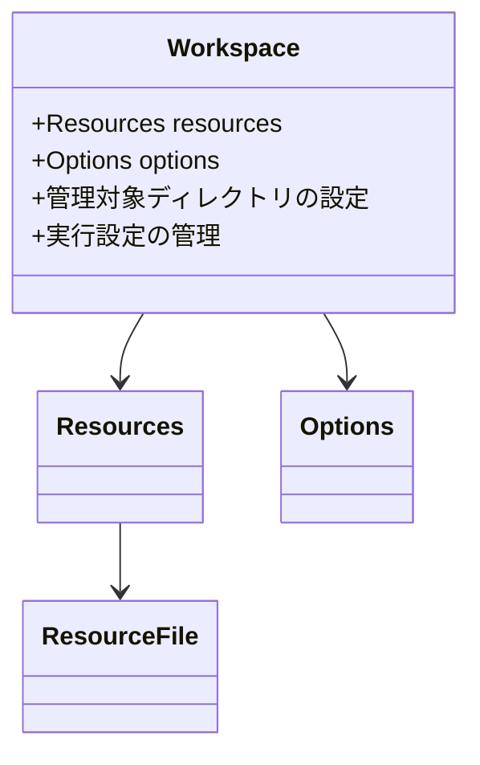
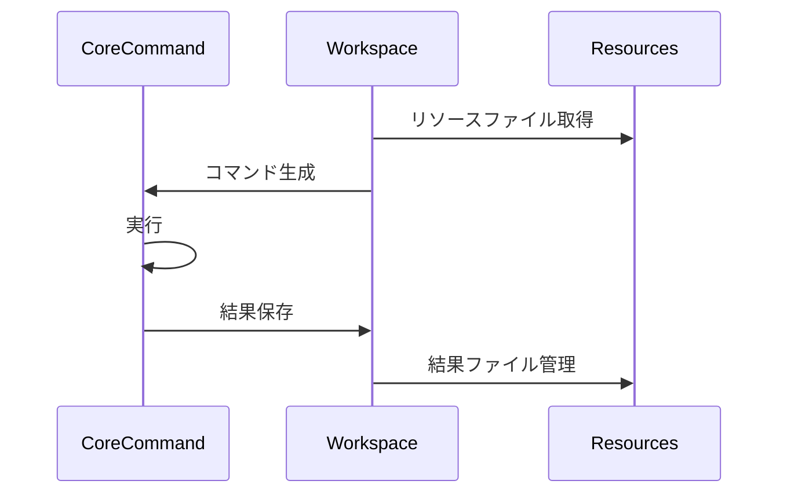
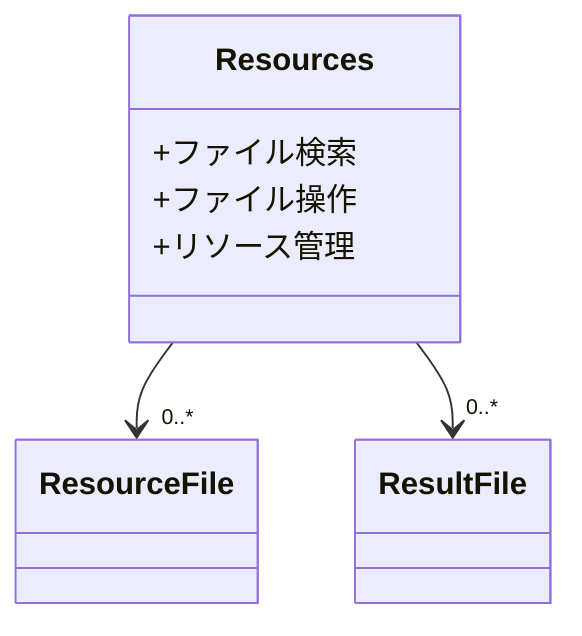

# Sidecarプロジェクト 共通開発ルール

このプロジェクトは、dbunitcliモノレポの一部として管理されています。
作業を始める前に、必ずdbunitcli/.roo/rules/01-rules.mdを参照してモノレポ全体の構成を把握してください。

このドキュメントは、`sidecar`プロジェクトにおける共通の開発ルールを定義します。
Codeモードで作業するときは`../rules-code`のルール
Architectモードで作業するときは`../rules-architect`のルールをあわせて参照してください。

## 0. Roo定義

このプロジェクトでは、Rooに以下のロールと必要な知識を設定します：

### 0.1. APIアーキテクト

役割：
- RESTful APIの設計と実装
- エンドポイントの定義と管理
- APIバージョニング戦略の策定
- クロスカッティングコンサーンの実装

必要な知識：
- Micronautフレームワークの深い理解
- RESTful API設計のベストプラクティス
- OpenAPI/Swagger仕様の知識
- セキュリティとパフォーマンスの最適化手法

### 0.2. 統合スペシャリスト

役割：
- coreプロジェクトとの連携実装
- GUIとバックエンドの統合設計
- データ変換層の実装
- エラーハンドリング戦略の策定

必要な知識：
- マイクロサービスアーキテクチャの理解
- dbunit-cliの機能と実装の詳細
- JSONデータ構造の設計経験
- 非同期処理パターンの実装経験

### 0.3. インフラストラクチャエンジニア

役割：
- アプリケーションの構成管理
- パフォーマンスモニタリング
- デプロイメント戦略の策定
- 運用環境の最適化

必要な知識：
- GraalVMネイティブイメージの構築技術
- Javaアプリケーションのチューニング
- コンテナ化技術とオーケストレーション
- ログ管理と監視の実装手法

## 1. プロジェクト概要

このプロジェクトは、dbunitcliモノレポにおいて、GUIアプリケーションとcoreプロジェクト間の橋渡しを担う重要なコンポーネントです。

主要な責務：

1. GUIインターフェース層
   - TauriプロジェクトのGUIからのRESTリクエストを受付
   - GUIのworkspaceフォルダを管理
   - 実行設定の永続化と管理を提供

2. コア連携層
   - coreプロジェクトのCLI機能を抽象化
   - GUIからの操作をCLIコマンドに変換
   - 実行結果をGUI表示用に最適化

3. データ管理層
   - データセットファイルの管理
   - コマンド実行結果の保存
   - リソースファイルの整理

これらの層を通じて、GUIアプリケーションからcoreプロジェクトの機能を効率的に利用できる環境を提供します。

## 2. 技術スタック

### 2.1. ビルドツール
- maven

### 2.2. アプリケーションフレームワーク
- micronaut 4.3.11
  - netty (HTTPサーバー)
  - jackson (シリアライゼーション)

### 2.3. テストフレームワーク
- JUnit5 (micronaut-test 4.2.1経由)

### 2.4. ランタイム
- Java 21
- graalvm (native-maven-plugin 0.10.0経由)

### 2.5. 主要な依存関係
- dbunit-cli 1.1-SNAPSHOT (coreプロジェクト)

## 3. 仕様ドキュメント

- バックエンドサービスとして提供するAPIを `docs` フォルダ以下の仕様ドキュメントにまとめる
- `docs` フォルダ以下のドキュメント構成は `docs/01-index.md` に記述する

## 4. アーキテクチャ詳細

### 4.1 パッケージ構造

```
yo.dbunitcli.sidecar
├── controller        # REST APIエンドポイントを提供するコントローラー
├── domain           # ビジネスロジックとドメインモデル
│   └── project     # プロジェクト関連のドメインモデル
└── dto             # APIリクエスト/レスポンス用のデータ転送オブジェクト
```

### 4.2 GUIのためのworkspaceフォルダ構成

```
workspace/
├── dataset/     # データセットファイル
├── option/      # コマンド実行設定
│   ├── compare/     # 比較設定
│   ├── convert/     # 変換設定
│   ├── generate/    # 生成設定
│   ├── parameterize/# パラメータ化設定
│   └── run/         # 実行設定
├── resources/   # 各種リソースファイル
│   ├── setting/     # メタデータ設定
│   ├── template/    # テンプレート
│   └── xlsx-schema/ # Excelスキーマ
└── result/      # 実行結果
```

ディレクトリの用途：
- dataset/ - 入力データセットの配置（`datasetBase`システムプロパティで変更可能）
- option/ - コマンド実行設定の保存
- resources/ - 各種リソースファイルの保存
- result/ - コマンド実行結果の出力（`resultBase`システムプロパティで変更可能）

### 4.3. ドメインモデルとcore連携 概要

このセクションでは、プロジェクトのドメインモデルとcoreプロジェクトとの連携について、3つの観点から説明します：

1. GUIバックエンド
2. coreプロジェクトのブリッジ
3. GUI-CLI間の中間層

### 4.4. GUIバックエンドとしてのドメインモデル

#### 4.4.1. Workspace
GUIの作業環境を管理するドメインモデルです：


#### 4.4.2. CommandType
GUIで選択可能なコマンドを表す列挙型：
- `compare` - データセット比較
- `convert` - フォーマット変換
- `generate` - データ生成
- `parameterize` - パラメータ化
- `run` - コマンド実行

### 4.5. coreプロジェクトのブリッジとしてのドメインモデル

#### 4.5.1. Command実行の流れ


#### 4.5.2. core側基底クラスとの連携
- Command<DTO, OPTION>
- CommandDto
- CommandLineOption<DTO>

### 4.6. GUI-CLI間の中間層としてのドメインモデル

#### 4.6.1. ファイルシステム管理

##### Resources
作業ディレクトリ内のリソースを管理：


##### Options
コマンド実行オプションの管理：
```mermaid
classDiagram
    Options --> "0..*" CommandOption
    Options --> CommandType
    class Options {
        +オプション保存
        +オプション読込
        +パラメータ変換
    }