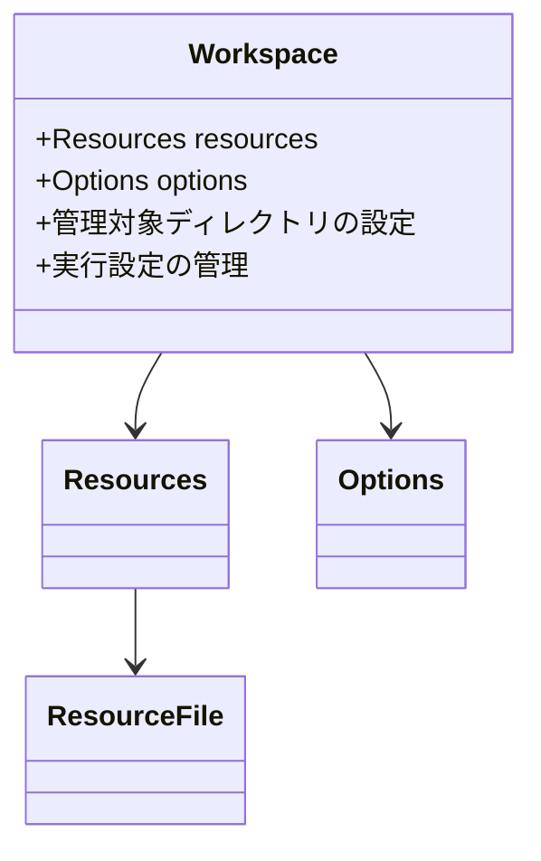

# GUIバックエンドとしてのドメインモデル

## Workspace
GUIの作業環境を管理するドメインモデルです：

## CommandType
GUIで選択可能なコマンドを表す列挙型：
- `compare` - データセット比較
- `convert` - フォーマット変換
- `generate` - データ生成
- `parameterize` - パラメータ化
- `run` - コマンド実行

以下のユースケースをサポートします：

### 1. 作業環境の管理
- workspaceディレクトリの初期化
- 各種設定の保存と読み込み
- リソースファイルの管理

### 2. コマンド実行の制御
- GUIからの操作をコマンドに変換
- コマンドの実行状態管理
- 実行結果のGUI表示への最適化