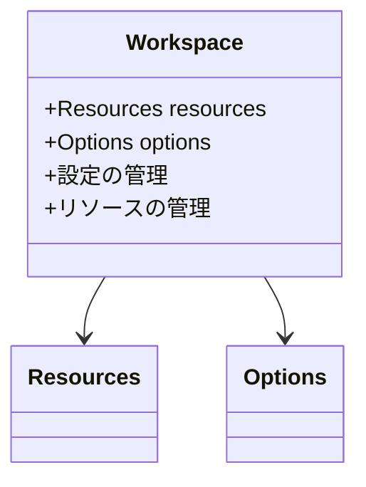

# GUIインターフェース層の設計

## インターフェース層の責務

### 1. RESTful API提供
- エンドポイントの実装
- リクエスト/レスポンスのバリデーション
- エラーハンドリング

### 2. GUIとの連携
- GUIからのリクエスト受付
- 実行結果のGUI表示用整形
- 非同期処理の状態管理
- リソース操作の提供

### 3. コマンド管理
GUIで利用可能なコマンドタイプ：
- `compare` - データセット比較
- `convert` - フォーマット変換
- `generate` - データ生成
- `parameterize` - パラメータ化
- `run` - コマンド実行

### 4. リソース管理
- リソースタイプ別の操作インターフェース提供
- リソースのCRUD操作
- リソースの検証と型安全性の確保

## Workspaceの管理

## 主要な機能

### 1. リクエスト処理
- RESTエンドポイントの提供
- DTOへのデシリアライズ
- バリデーション処理

### 2. 実行管理
- コマンド実行状態の管理
- 非同期処理の制御
- エラー通知

### 3. リソース操作
- データベース接続設定の管理
- テンプレートリソースの操作
- データセット設定の管理

## 関連ドキュメント
- [アーキテクチャ概要](./01-overview.md)
- [ファイルシステム層](./03-middleware.md)
- [coreプロジェクト連携](./04-core-bridge.md)
