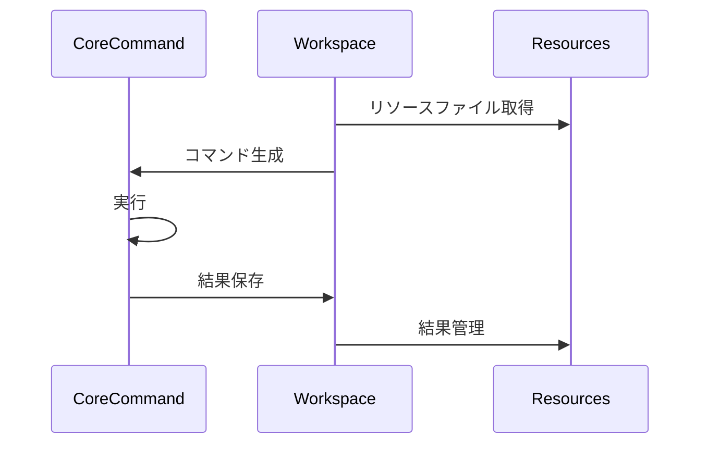

# コア連携層の設計

## Command実行の流れ

## core側との連携

### Command基底クラス
- Command<DTO, OPTION>
  - DTOはコマンド固有のデータ構造
  - OPTIONはコマンドライン引数の型

### データ変換
- CommandDto
  - GUIからのリクエストデータをcore側DTOに変換
  - 実行結果をGUI表示用に変換

### オプション管理
- CommandLineOption<DTO>  
  - GUIの設定をコマンドライン引数に変換
  - オプションの検証と正規化

## 実行フロー

### 1. コマンド生成
- DTOからコマンドインスタンスを生成
- 必要なリソースの準備
- 実行環境の確認

### 2. 実行制御
- coreプロジェクトのCLI機能呼び出し
- 実行状態のモニタリング
- エラーハンドリング

### 3. 結果処理
- 実行結果の取得
- 結果データの変換
- GUI表示用の最適化

## 関連ドキュメント
- [アーキテクチャ概要](./01-overview.md)
- [GUIインターフェース層](./02-gui-backend.md)
- [ファイルシステム層](./04-middleware.md)