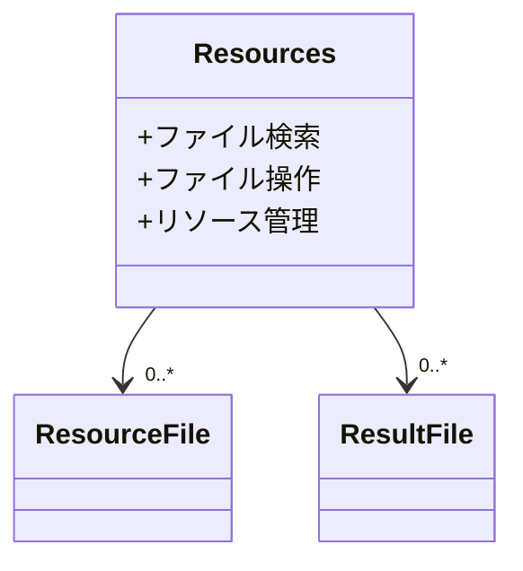
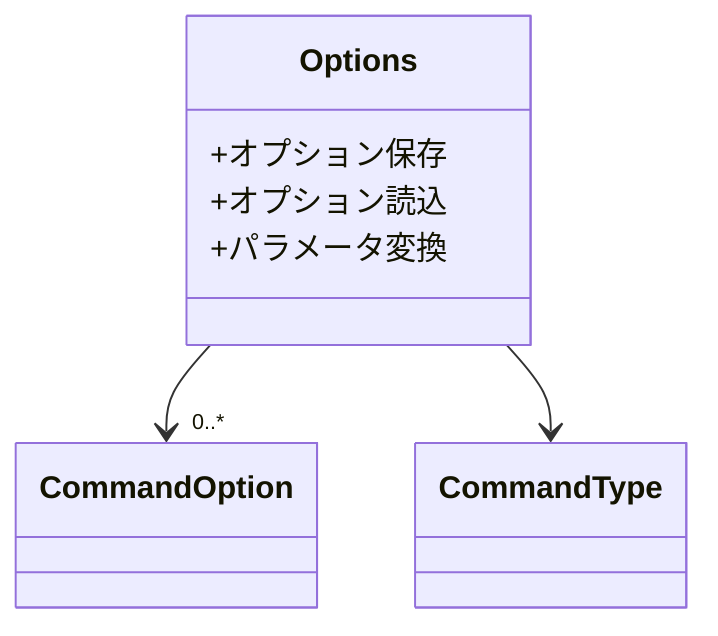
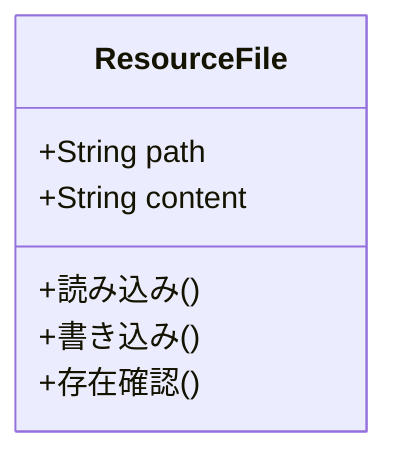

# GUI-CLI間の中間層としてのドメインモデル

## ファイルシステム管理

### Resources
作業ディレクトリ内のリソースを管理：


### Options
コマンド実行オプションの管理：


## 主要な機能

### 1. ファイルシステムの抽象化
- workspaceディレクトリの構造管理
- ファイルの検索と操作の統一インターフェース
- 実行結果の保存と取得

### 2. オプション管理
- コマンド実行設定の永続化
- 設定の検証とデフォルト値の提供
- GUIとCLI間のパラメータ変換

### 3. リソース管理
- データセットファイルの管理
- テンプレートファイルの管理
- メタデータ設定の管理

## ファイル操作の抽象化

### ResourceFile


### ResultFile
```mermaid
classDiagram
    class ResultFile {
        +String path
        +MetaData metadata
        +保存()
        +取得()
        +メタデータ更新()
    }