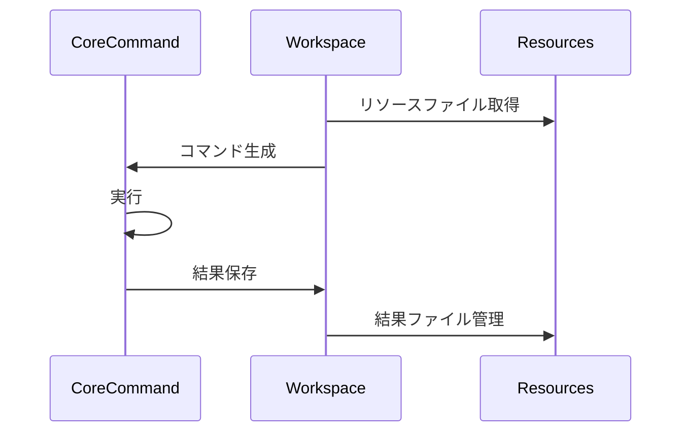

# coreプロジェクトのブリッジとしてのドメインモデル

## Command実行の流れ

## core側基底クラスとの連携

### Command基底クラス
- Command<DTO, OPTION>
  - DTOはコマンド固有のデータ構造
  - OPTIONはコマンドライン引数の型

### データ変換
- CommandDto
  - GUIからのリクエストデータをcore側DTOに変換
  - 実行結果をGUI表示用に変換

### オプション管理
- CommandLineOption<DTO>  
  - GUIの設定をコマンドライン引数に変換
  - オプションの検証と正規化

## コマンド実行の流れ

1. GUIからのリクエスト受付
   - RESTエンドポイントでJSONを受信
   - DTOへのデシリアライズ

2. コマンド生成
   - DTOからコマンドインスタンスを生成
   - 必要なリソースファイルの準備

3. 実行と結果管理
   - coreプロジェクトのCLI機能を呼び出し
   - 実行結果をファイルに保存
   - 結果をGUI表示用に加工して返却