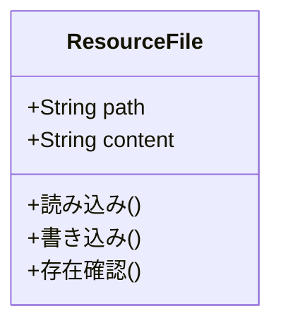
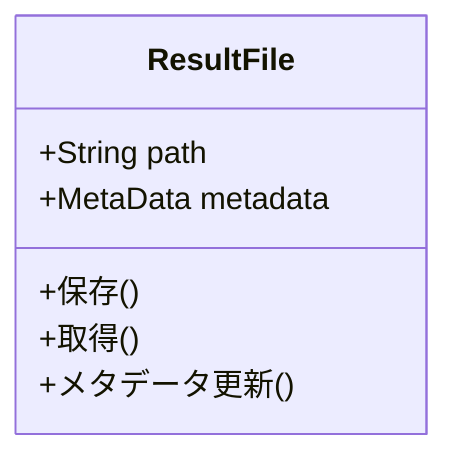

# ファイルシステム層の設計

## リソースモデル

### ResourceFile


### ResultFile


## ファイルシステム構成

```
workspace/
├── dataset/     # データセットファイル
├── option/      # コマンド実行設定
│   ├── compare/     # 比較設定
│   ├── convert/     # 変換設定
│   ├── generate/    # 生成設定
│   ├── parameterize/# パラメータ化設定
│   └── run/         # 実行設定
├── resources/   # 各種リソースファイル
│   ├── setting/     # メタデータ設定
│   ├── template/    # テンプレート
│   └── xlsx-schema/ # Excelスキーマ
└── result/      # 実行結果
```

## 主要な機能

### 1. リソース管理
- ファイルの検索と操作
- メタデータの管理
- バックアップの作成

### 2. 設定管理
- コマンド設定の永続化
- デフォルト値の提供
- 設定の検証

### 3. 実行結果管理
- 結果ファイルの保存
- 実行履歴の記録
- 一時ファイルの管理

## 関連ドキュメント
- [アーキテクチャ概要](./01-overview.md)
- [GUIインターフェース層](./02-gui-backend.md)
- [コア連携層](./03-core-bridge.md)